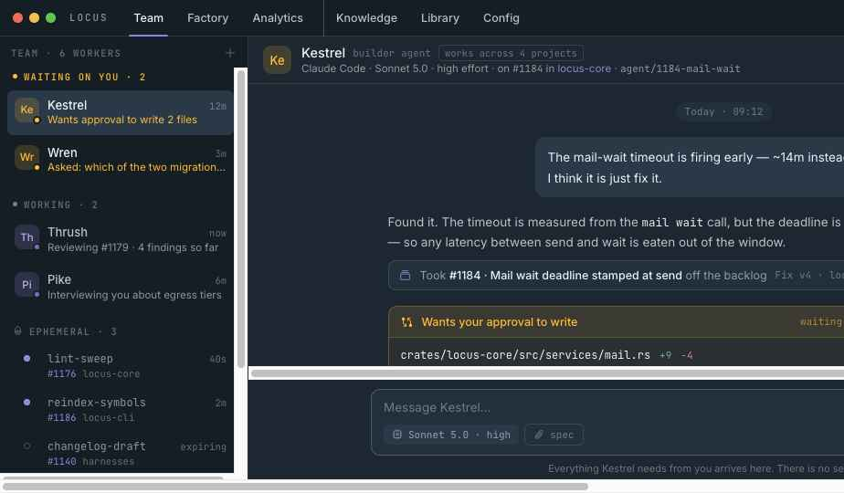

# Locus v3 — change log

Rebuild of the Locus desktop mockup as a software factory crossed with a
conversational agent product. Everything below is in `Locus v3.dc.html`.

---

## 1. Navigation

Six top-level destinations, replacing the old rail:

| Destination | Holds |
|---|---|
| **Team** | Named Workers and the conversation with one |
| **Factory** | Backlog · Planner · Kanban · Timeline · List · Dispatch · Portfolio |
| **Analytics** | Overview and Telemetry, own project selector |
| **Knowledge** | Base context · Short-term · Long-term · Wiki · Artifacts |
| **Library** | Orchestrators, what Workers are, what they run on |
| **Config** | Projects · Dispatch policy · Guardrails · Settings |

A divider separates Analytics from Knowledge. The title bar carries a live
running/queued pill and **Stop all**.

## 2. Terminology

- **Orchestrator** — versioned, deployable graph (was Workflow)
- **Worker** — named agent with persistent identity, crosses every project
- **Ephemeral** — a run that belongs to a project and a task, listed above
  Standing By with its agent, task number and project
- **Portfolio** — all projects side by side

## 3. Team

One conversation per Worker. Approvals, memory promotions and diffs arrive
in the thread — there is no separate inbox. Worker config picks an **agent
definition** from the Library rather than inventing roles; harness and model
are separate fields (Claude Code / Sonnet 5.0); tools default to *follow the
agent's tool permissions*.

## 4. Planner — the largest change

### Six stages, one shape for all scopes

`Start → Orient → Converse → Recommend → Decompose → Approved`

Synthesis was removed as a step — it asked nothing of the user. What it
produced (15 drafted, 4 cut, 2 rewritten) appears as a provenance strip on
Recommend.

### Guided, not declared

The user never picks a plan type. **Start** is one field — "in your words" —
plus a project picker with **New project**, which reveals only two fields
(name, managed/linked). Involved repos, tools and orchestrator are proposed
later, not asked up front.

**Orient** indexes, then classifies: *this looks like a whole new project /
one new feature / a change to something already built*, with the evidence it
used and an option to correct it.

### Converse is an interrogation

Pike decides what research can settle and only asks what it cannot. Two turn
types beyond question-and-answer:

- **Pushback** — "'Fine' is not something I can hand to a Worker." An
  unfalsifiable answer is sent back for a number.
- **Contradiction** — two earlier answers placed side by side, with the note
  that if the user does not pick, the Worker will.

Side panel tabs: **Topics** (the actual threads of this conversation),
**Plan** (the durable object — goal, use cases, decisions, open questions,
config revision; clicking one opens a detail panel), **Research** (grouped by
source: this repo with file:line, knowledge with confidence, other projects,
the web with links, and *looked for, not found*). Any research line opens in
the same right-hand panel.

For a new project, a coverage strip shows which features the one conversation
has and has not touched.

### Recommend

Spec list on the left, one complete sheet on the right. Every spec arrives
finished — states are only *approved* or *ready to read*. Approve or send back
to Converse, per spec.

Spec format: Summary · Who it's for · What it does (numbered) · What it does
NOT do · a fields table with examples · Rules (R1…Rn) · Edge cases we thought
about · How we'll know it works · Open questions (always with a default).
Every field is a real control — text, textarea, list rows with add/remove,
editable table rows.

### Decompose

Same spec panel on the left; all specs' cards in one grouped table. Columns:
id, task, **covers** (which rules), after, **runs as**, own card / rides along.
The bar above is defaults; every row can override model and effort, and
overridden rows are amber. Clicking a task id opens a detail panel — rules
quoted in full, runs-as with reset, dependencies, why it was carved out, and
done-when criteria.

### Approved

Reads "one step left". The primary action is **Open the project record** — the
plan is not released until the configuration it proposed is accepted there.

## 5. Project record

Matches v2: `#project` in mono accent, `locus://project`, a state chip, a
Settings/Persistence/Analytics segmented control, Archive/Rename.

Five cards, in v2's order and pattern — uppercase label, inline description,
right-aligned meta, bordered inner surface, closing grey line:

**Harnesses** · **Repos** · **Extensions** (type tabs → per-type panel with an
all-toggle and a two-column grid) · **CLI tools** (catalog search + in-project)
· **Base context** (token meter, History/Save).

A project created by a plan carries an amber **Setup incomplete** block listing
what the plan proposed and never had accepted, with the count of cards waiting.

## 6. Factory

- **Kanban** — Ready · In Progress · Agent Review · Human Approval · Deployed,
  with an All-tasks / With-an-agent toggle and a task drawer (Overview with
  narrative and spec links, Agent history across runs, Diff, Settings)
- **Backlog** — drag-ordered, Next up vs Later
- **Timeline** — wall-clock bars, amber for time waiting on a person
- **Dispatch** — Queue, Schedules, Run log; policy lives in Config
- **Portfolio** — every project, the *waiting on you* column emphasised

## 7. Library

Orchestrator canvas (visual graph + Governance) plus a shared extension editor
covering agents, skills, commands, rules, output styles, hooks, linters,
harnesses, providers, CLI tools — each with its own record shape, a
materialization rail showing native vs downgraded across 11 harnesses, and
version history.

## 8. Removed

Routines, Stations, the Computer panel, the Features stage, the Project setup
stage, verify-command as a project setting, and every explanatory annotation
in Recommend.
